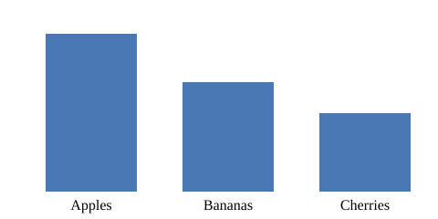

#+TITLE: org-slideboard
#+SUBTITLE: Live presentations inside Emacs
#+AUTHOR: Vikas Rawal
#+DATE: \today
#+OPTIONS: toc:nil H:2 tags:nil num:nil
#+LATEX_CLASS: beamer
#+LATEX_HEADER: \setbeamersize{text margin left=5mm,text margin right=5mm}
#+MACRO: pkg /org-slideboard/
#+MACRO: hl @@latex:\textbf{\color{$1}$2}@@
#+SLIDEBOARD_MACRO: hl *$2*
#+MACRO: alert @@latex:\alert{$1}@@@@slideboard:*$1*@@
#+SLIDEBOARD: footline:("%a" "%S" "%n / %N")

# This file is a presentation about org-slideboard, shown with
# org-slideboard.  Open it and run M-x org-slideboard-start-slideshow.
# PgDn and PgUp move between slides; M-ESC q stops.  It also exports to
# a beamer PDF with C-c C-e l P.

* Getting started

** What org-slideboard does                                           :slide:
{{{pkg}}} turns an org file into a presentation, which is run inside
Emacs, but with the possibility of modifying its content during the
presentation.

+ It is made for files written for *beamer export*: the same file can
  be used for producing a beamer PDF and for direct presentation from
  within emacs.
+ Beamer columns, equations, tables, macros and code blocks are
  rendered automatically.
+ The text stays live Org: you can modify content, add/delete content,
  and run code, during the presentation.

This makes the presentation a powerful tool for pedagogical purposes
as the instructor can also use the presentation as a whiteboard as
well as demonstrate the results of executing some code.

This presentation is itself an Org file for {{{pkg}}}: every slide
uses the feature it describes.

** Starting, moving and stopping                                      :slide:
| Key                                  | Does                                   |
|--------------------------------------+----------------------------------------|
| =M-x org-slideboard-start-slideshow= | start at the title page                |
| =M-x org-slideboard-open-slide=      | start at the slide where the cursor is |
| =PgDn= / =PgUp=                      | next / previous slide                  |
| =C-c ;=                              | show the current slide again           |
| =M-ESC g=                            | go to a slide by number                |
| =M-ESC t=                            | table of contents                      |
| =M-ESC 0=                            | text and frame sizes back to the start |
| =M-ESC q=                            | stop the show                          |

These keys work in the windows of the slides only; everywhere else, your own
keys keep working.  In the table of contents, click a slide to go to it, or
press =q= to close it.  During the show, the same commands are in the
/org-slideboard/ menu.

** Slides are headings with a tag                                     :slide:
A slide is a heading with the =:slide:= tag.  With =#+OPTIONS: H:2=, tag the
level-2 headings; the level-1 headings above them become *section pages*.

#+begin_example
,* Getting started
,** What org-slideboard does                                      :slide:
#+end_example

+ =tags:nil= in =#+OPTIONS= keeps the tag out of the PDF.
+ Slides under a =COMMENT= heading are skipped, as in beamer export.  The next
  slide in this file is commented out, so you will not see it.
+ To tag all level-2 headings of a file at once, evaluate this in the file's buffer:

  #+begin_example
   (org-map-entries (lambda () (org-toggle-tag "slide" 'on)) "LEVEL=2")
  #+end_example

** COMMENT A slide you will not see                                   :slide:
This slide is skipped, just as beamer skips it.

** The file stays live                                                :slide:
The windows of a slide show the presentation file itself, so what you type
during the show goes straight into the file.

+ Fix a typo on the spot, add a point, run a code block.
+ After adding or removing slides, start the show again (or run
  =M-x org-slideboard-initialize=) to rebuild the list of slides.
+ Starting and stopping a show do not change the file.

* Layout

** Beamer columns                                                     :slide:
Text before the columns gets a frame of its own, across the slide.

*** Left                                                              :BMCOL:
:PROPERTIES:
:BEAMER_col: 0.45
:END:
Columns are children of the slide heading with a =BEAMER_col= property (or
the =BMCOL= tag), exactly as for beamer.

Each column is shown in its own window.

*** Right                                                             :BMCOL:
:PROPERTIES:
:BEAMER_col: 0.55
:END:
+ Widths follow the =BEAMER_col= values.
+ A column without a width gets an equal share.
+ Images are scaled to their column.
+ Each column can be scrolled and resized on its own.

** Titles, frames and pages                                           :slide:
Every slide is laid out the same way:

+ a *title strip* at the top, with the heading of the slide;
+ below it, one or more *frames*: the body of the slide, the text before its
  columns, each beamer column, code and results;
+ the *information strip* at the bottom.

The title page comes from =#+TITLE=, =#+SUBTITLE=, =#+AUTHOR= and =#+DATE=,
and each level-1 heading gets a section page, like the one you saw before
this part.

+ LaTeX in these keywords is tidied: =\\= starts a new line, =\and= becomes
  a comma, =\today= becomes the date (as on the title page of this file).
+ The pages are animated in; any key skips the animation.
  =#+SLIDEBOARD: animate:nil= turns it off, =page-scale:= sets their text
  size, and =title-page:nil= or =section-pages:nil= leaves them out.

** The information strip                                              :slide:
The line at the bottom of this slide is the information strip.  This file
sets it with

#+begin_example
,#+SLIDEBOARD: footline:("%a" "%S" "%n / %N")
#+end_example

| Escape      | Shows                           |
|-------------+---------------------------------|
| =%t= / =%s= | title / subtitle                |
| =%a= / =%d= | author / date                   |
| =%S=        | section above the slide         |
| =%h=        | heading of the slide            |
| =%n= / =%N= | slide number / number of slides |

Any other text is shown as it is, and =%%= is a =%=.
=footline-position:top= moves the strip to the top, and =footline:nil=
removes it.  In your configuration, =org-slideboard-footline= can also hold
functions, e.g. one that shows the time.

* Text

** Text size                                                          :slide:
Text is never shrunk to fit.  You choose the size during the show:

| Keys                  | Change                                |
|-----------------------+---------------------------------------|
| ~C-=~ / ~C--~         | all frames of all slides              |
| =C-c }= / =C-c {=     | the selected frame of this slide only |
| ~C-x C-=~ / ~C-x C--~ | the selected frame, too               |
| =M-ESC 0=             | everything back to the starting size  |

A frame resized on its own keeps its size when you come back to the slide.
Titles and the information strip keep theirs.  Try it: this slide has two
frames below the title.

*** Left                                                              :BMCOL:
:PROPERTIES:
:BEAMER_col: 0.5
:END:
Select this column and press =C-c }= a few times.

*** Right                                                             :BMCOL:
:PROPERTIES:
:BEAMER_col: 0.5
:END:
This column keeps its size.

** Resizing frames                                                    :slide:
Frames start at their =BEAMER_col= widths, and code and results at
=code-width= (0.5).  When that does not suit the content, change it:

*** Left                                                              :BMCOL:
:PROPERTIES:
:BEAMER_col: 0.3
:END:
+ Drag the divider between this column and the next.
+ Or, in a frame, press =C-x }= / =C-x {= for wider / narrower, and =C-x ^=
  for taller.

*** Right                                                             :BMCOL:
:PROPERTIES:
:BEAMER_col: 0.7
:END:
The slide is shown again with the new sizes, so images are scaled to their
new windows, and it keeps them when you come back.

=C-x C-0= puts the text of a frame back to the common size; =M-ESC 0= puts
every frame of every slide back to where the show started.

** Lists                                                              :slide:
+ Bullets change with the depth of the item.
  + Sub-items are indented, in the text font, so the indentation grows with
    the text.
    + And so on, for deeper levels.
+ A long item wraps under its own text, not under the bullet, so it stays
  easy to read even when it runs over two or three lines of the slide.
1. Numbered items keep their numbers.
2. Like this.

** Paragraphs are reflowed                                            :slide:
This paragraph is written in the file with short,
hard-wrapped lines,
as Org files often are.
On the slide it is joined into one paragraph
that wraps to the width of the window,
as LaTeX would do.

A blank line still starts a new paragraph.

** Clutter is hidden                                                  :slide:
:PROPERTIES:
:NOTE: property drawers are hidden
:END:
Beamer and babel lines that only matter for export are not shown: property
drawers, =#+NAME:=, =#+CAPTION:= and =#+ATTR_...:= lines, stray LaTeX such as
=\vspace=, and code blocks exported as results only.

\vspace{2mm}
#+NAME: tbl-hidden-keywords
#+ATTR_LATEX: :align ll
| Written in the file        | On the slide |
|----------------------------+--------------|
| =#+NAME:=, =#+ATTR_LATEX:= | hidden       |
| =\vspace{2mm}=             | hidden       |
| a =:PROPERTIES:= drawer    | hidden       |

=#+SLIDEBOARD: clutter:nil= shows all of it again.

* Look and feel

** Beautification during the show                                     :slide:
While the show runs, the slides are made to look like slides; when it stops,
the file looks as it did before.

| Key              | Default | Does                                    |
|------------------+---------+-----------------------------------------|
| =variable-pitch= | =t=     | proportional (variable-width) text      |
| =modern=         | =t=     | styled headings from org-modern         |
| =emphasis=       | =t=     | =*bold*= shown without the asterisks    |
| =macro-markers=  | =t=     | braces of unexpanded macros hidden      |

Turned off during the show: =org-indent-mode= and line numbers (=disable:=).

To try fixed-width text, add =variable-pitch:nil= to this file's
=#+SLIDEBOARD:= line and start the show again.  The setting applies to the
whole presentation.  In variable-width text, code blocks can lose their
alignment; tables are re-aligned.

** Bullets and indentation                                            :slide:
+ Bullets come from =bullets:=, one per level of depth:
  + the default is =("●" "○" "■" "□")=;
    + =bullets:("➤" "–" "•")= gives arrows and dashes;
    + =bullets:nil= keeps the bullets of the file (or org-modern's).
+ =list-indent:6= indents each level by six spaces instead of four.
+ =hanging:nil= stops wrapped lines from starting under the text of their
  item, so they start at the left margin instead.

** Images                                                             :slide:
*** Image                                                             :BMCOL:
:PROPERTIES:
:BEAMER_col: 0.5
:END:
#+begin_src emacs-lisp :exports none :eval never :results file
;; the plot is made on the slide "Results only, with a plot"
#+end_src

#+RESULTS:

*** Text                                                              :BMCOL:
:PROPERTIES:
:BEAMER_col: 0.5
:END:
An image is scaled down to fit its window.  Two settings limit its size, as
fractions of the window:

| Key             | Default | Limits         |
|-----------------+---------+----------------|
| =image-width=   |     0.8 | width          |
| =image-height=  |     0.8 | height         |

To make images smaller, say at most half the width and 60% of the height
of their windows, add to the top of the file:

#+begin_example
,#+SLIDEBOARD: image-width:0.5 image-height:0.6
#+end_example

and start the show again.  Use 1.0 to let images fill their windows.  The
setting applies to all slides; to set it for every presentation, set
=org-slideboard-image-width-fraction= and
=org-slideboard-image-height-fraction= in your configuration.

An image file that has changed, e.g. a plot rewritten by a code block, is
read again when the slide is shown again.

* Equations, macros and tables

** Equations                                                          :slide:
Inline math such as $e^{i\pi} + 1 = 0$ sits in the text, at the size of the
text.  Display math starts on its own line:

\[
  \bar{x} = \frac{1}{n} \sum_{i=1}^{n} x_i
\]

\begin{align*}
  (a + b)^2 &= a^2 + 2ab + b^2 \\
  (a - b)^2 &= a^2 - 2ab + b^2
\end{align*}

Equations follow the text size, and beamer-only =#+LATEX_HEADER:= lines
(this file has one) are kept out of the equation images.

** Size and placement of equations                                    :slide:
Equations are drawn at =latex-size:= (0.8) times the size of the text, and
rendered at =latex-scale:= (4.0) so that they stay sharp.

\begin{equation}
  y_t = \alpha + \beta x_t + \varepsilon_t
\end{equation}

A numbered equation is as wide as a LaTeX page, since the number sits at the
right margin, so it may be shrunk to fit.  Without a number it is not:

\begin{equation*}
  y_t = \alpha + \beta x_t + \varepsilon_t
\end{equation*}

Display equations start at the left margin; =center-math:t= centres them, as
LaTeX does.  For example: =#+SLIDEBOARD: latex-size:1.0 center-math:t=.

** Macros                                                             :slide:
Org macros are shown expanded:

+ ={{{pkg}}}= shows as {{{pkg}}}.
+ ={{{date}}}= shows the date: {{{date}}}.
+ ={{{hl(red,important)}}}= is {{{hl(red,important)}}}.

The last one is defined twice: for the PDF with =#+MACRO:=, as coloured LaTeX,
and for the show with

#+begin_example
,#+SLIDEBOARD_MACRO: hl *$2*
#+end_example

so on a slide it is just bold text.

** More ways to define macros for the show                            :slide:
A =@@slideboard:...@@= snippet keeps the show version on the =#+MACRO:= line
itself.  This file has

#+begin_example
,#+MACRO: alert @@latex:\alert{$1}@@@@slideboard:*$1*@@
#+end_example

so ={{{alert(look here)}}}= is {{{alert(look here)}}}: red in the PDF, bold
on the slide.

+ In your configuration, =org-slideboard-macro-templates= can define a macro
  for every presentation, as a template or a function returning text with
  faces.
+ Macros that evaluate Lisp are never expanded, so starting a show never runs
  code from the file.
+ =#+SLIDEBOARD: macros:nil= turns expansion off.

** Tables                                                             :slide:
A dummy table with a macro, an equation and numbers.  On the slide, the
columns are aligned to what is shown, not to the text in the file:

| Fruit                | Price |          Sold | Revenue |
|----------------------+-------+---------------+---------|
| {{{hl(red,Apples)}}} |  1.20 | $3 \times 40$ |  144.00 |
| Bananas              |  0.50 |           200 |  100.00 |
| Cherries             |  6.00 |            12 |   72.00 |

Numbers stay right-aligned, as Org aligns them.
=#+SLIDEBOARD: align-tables:nil= keeps Org's own alignment.

* Code and results

** Code and its results                                               :slide:
A code block with =:exports both= is shown with its results: results above,
code below, by default.

#+begin_src emacs-lisp :exports both :results output
(dolist (fruit '("apples" "bananas" "cherries"))
  (princ (format "%-9s %d letters\n" fruit (length fruit))))
#+end_src

#+RESULTS:
: apples    6 letters
: bananas   7 letters
: cherries  8 letters

** Run the code during the show                                       :slide:
Put the cursor in the code and press =C-c C-c=: the block runs, and the slide
is shown again with the new results.

#+begin_src emacs-lisp :exports both :results output
(princ (format "This block last ran at %s" (format-time-string "%H:%M:%S")))
#+end_src

#+RESULTS:
: This block last ran at 10:00:00

Press =C-c C-c= in the code window and watch the time change.

** Code on the left, results on the right                             :slide:
:PROPERTIES:
:SLIDEBOARD_SRC_SPLIT: lr
:END:
The property =SLIDEBOARD_SRC_SPLIT= arranges code and results: =bt= (the
default), =tb=, =lr= or =rl=, naming where the code goes and then the results.
Drag the line between them to give one more room; the slide remembers it,
and =M-ESC 0= puts it back.

#+begin_src emacs-lisp :exports both
(let ((prices '(1.20 0.50 6.00))
      (sold '(120 200 12)))
  (cl-loop for p in prices
           for s in sold
           sum (* p s)))
#+end_src

#+RESULTS:
: 316.0

** Code in a column                                                   :slide:
*** Explanation                                                       :BMCOL:
:PROPERTIES:
:BEAMER_col: 0.4
:END:
A column that holds a code block is divided into code and results.

This column is text only; the other one has
=SLIDEBOARD_SRC: both= and =SLIDEBOARD_SRC_SPLIT: tb=, so its code is shown,
above its results.

*** Code                                                              :BMCOL:
:PROPERTIES:
:BEAMER_col: 0.6
:SLIDEBOARD_SRC: both
:SLIDEBOARD_SRC_SPLIT: tb
:END:
#+begin_src emacs-lisp :exports results
(mapconcat (lambda (n) (number-to-string (* n n)))
           (number-sequence 1 10) " ")
#+end_src

#+RESULTS:
: 1 4 9 16 25 36 49 64 81 100

** Results only, with a plot                                          :slide:
:PROPERTIES:
:SLIDEBOARD_SRC: results
:END:
With =SLIDEBOARD_SRC: results= only the result of a block is shown: here a
small bar chart, made by the code block as an SVG file and scaled to the
window.  (The block is =:exports none=, so the beamer PDF leaves the SVG out:
pdflatex cannot include SVG files.)

#+begin_src emacs-lisp :exports none :results file :file demo-plot.svg
(let* ((data '(("Apples" . 144) ("Bananas" . 100) ("Cherries" . 72)))
       (w 480) (h 240) (bar 100) (gap 50) (x gap))
  (concat
   (format "<svg xmlns='http://www.w3.org/2000/svg' width='%d' height='%d'>" w h)
   "<rect width='100%' height='100%' fill='white'/>"
   (mapconcat
    (lambda (d)
      (let* ((bh (round (* 1.2 (cdr d))))
             (s (format (concat "<rect x='%d' y='%d' width='%d' height='%d' fill='#4a78b5'/>"
                                "<text x='%d' y='%d' font-size='16' text-anchor='middle'>%s</text>")
                        x (- h 30 bh) bar bh (+ x (/ bar 2)) (- h 10) (car d))))
        (setq x (+ x bar gap))
        s))
    data "")
   "</svg>"))
#+end_src

#+RESULTS:

** Editing with a REPL                                                :slide:
:PROPERTIES:
:SLIDEBOARD_SRC_SPLIT: lr
:END:
Put the cursor in the code and press =C-c '=: the code opens in its own
editing buffer, next to a running REPL (Python here, R through ESS), where
you can try it out line by line.  =C-c '= again brings the slide back.

#+begin_src python :exports both :results output
fruits = {"apples": 144, "bananas": 100, "cherries": 72}
for name, revenue in fruits.items():
    print(f"{name:9} {revenue:6.2f}")
#+end_src

#+RESULTS:
: apples    144.00
: bananas   100.00
: cherries   72.00

** Sessions and other languages                                       :slide:
+ A block with a =:session= header uses that session for its REPL, in any
  language.
+ Without one, R gets an ESS process and Python =run-python=; both are
  started if they are not running, and keep running after the show.
+ Other languages can be added to =org-slideboard-src-repl-functions=, with a
  function that returns the REPL buffer (the README has one for Julia).
+ Blocks with =:exports none= are never shown, whatever =src:= says.
+ =code-width:= (0.5) is the code's share of the slide, beside or above its
  results.

* Settings

** Settings for one presentation                                      :slide:
Most settings can be given in the file itself, on =#+SLIDEBOARD:= lines:

#+begin_example
,#+SLIDEBOARD: text-scale:3 title-scale:2 footline:nil
,#+SLIDEBOARD: src:both src-split:lr variable-pitch:nil
#+end_example

The syntax is that of =#+OPTIONS=: =key:value= pairs, with values written as
Lisp (=t=, =nil=, numbers, ="strings"=, lists).  The lines are read when the
show starts, and the previous values come back when it stops.  Beamer
ignores them.  Unknown keys and bad values are skipped with a message.

The next slide lists all the keys.

** All the keys of =#+SLIDEBOARD:=                                    :slide:
*** Left                                                              :BMCOL:
:PROPERTIES:
:BEAMER_col: 0.5
:END:
| Topic           | Keys                                                    |
|-----------------+---------------------------------------------------------|
| look and feel   | =modern=, =variable-pitch=, =emphasis=, =macro-markers= |
| modes           | =modes=, =disable=                                      |
| lists           | =bullets=, =list-indent=, =hanging=                     |
| sizes           | =text-scale=, =title-scale=, =page-scale=               |
| pages           | =title-page=, =section-pages=, =animate=                |
| images          | =image-width=, =image-height=                           |

*** Right                                                             :BMCOL:
:PROPERTIES:
:BEAMER_col: 0.5
:END:
| Topic           | Keys                                       |
|-----------------+--------------------------------------------|
| equations       | =latex-size=, =latex-scale=, =center-math= |
| macros, tables  | =macros=, =align-tables=                   |
| code            | =src=, =src-split=, =code-width=           |
| hidden clutter  | =clutter=                                  |
| information     | =footline=, =footline-position=            |

Each key sets an =org-slideboard-...= variable; the README has the table.

** Settings for one slide or section                                  :slide:
:PROPERTIES:
:SLIDEBOARD_SRC: results
:END:
Two settings can also be given as heading properties:

| Property               | Values                         |
|------------------------+--------------------------------|
| =SLIDEBOARD_SRC=       | =exports=, =results= or =both= |
| =SLIDEBOARD_SRC_SPLIT= | =bt=, =tb=, =lr= or =rl=       |

Properties are inherited: set on a level-1 heading, they apply to every
slide of that section; set on a beamer column, to that column only.  This
slide sets =SLIDEBOARD_SRC: results= in its hidden drawer, so the block
below shows only its result:

#+begin_src emacs-lisp :exports both
(format "6 times 7 is %d" (* 6 7))
#+end_src

#+RESULTS:
: 6 times 7 is 42

** Other ways to give settings                                        :slide:
+ *Globally*, in your configuration: =M-x customize-group RET
  org-slideboard=.
+ *File-local variables*, in the usual Emacs block at the end of the file,
  e.g. =org-slideboard-text-scale: 3=.  These are read when the file is
  opened (=M-x revert-buffer= after a change).
+ *Precedence*: =#+SLIDEBOARD:= beats a file-local variable, which beats the
  global value.
+ *Faces*: bullets, the information strip, the divider between code and
  results and the title and section pages have their own faces, for
  =M-x customize-face= (=org-slideboard-bullet=, =org-slideboard-footline=, ...).

** Changing the keys                                                  :slide:
The keys of the show are in =org-slideboard-keys-mode-map=, and can be
changed like any Emacs keys:

#+begin_src emacs-lisp :eval never
(with-eval-after-load 'org-slideboard
  (define-key org-slideboard-keys-mode-map [f6] #'org-slideboard-execute-slide)
  (define-key org-slideboard-keys-mode-map (kbd "C-=") nil))
#+end_src

A key set to =nil= gives the key back to you.  Function keys are left free for
you to use.  The keys of the code window (=C-c C-c=, =C-c '=) are in
=org-slideboard-code-mode-map=.  To keep Emacs's zoom keys as plain zoom, set
=org-slideboard-zoom-resizes-frame= to =nil=.

** That's it                                                          :slide:
+ Installation and all settings: the =README.org= in the repository.
+ This file is a template: copy it, replace the slides with yours, and keep
  the header lines you need.

Press =M-ESC q= to stop the show.
